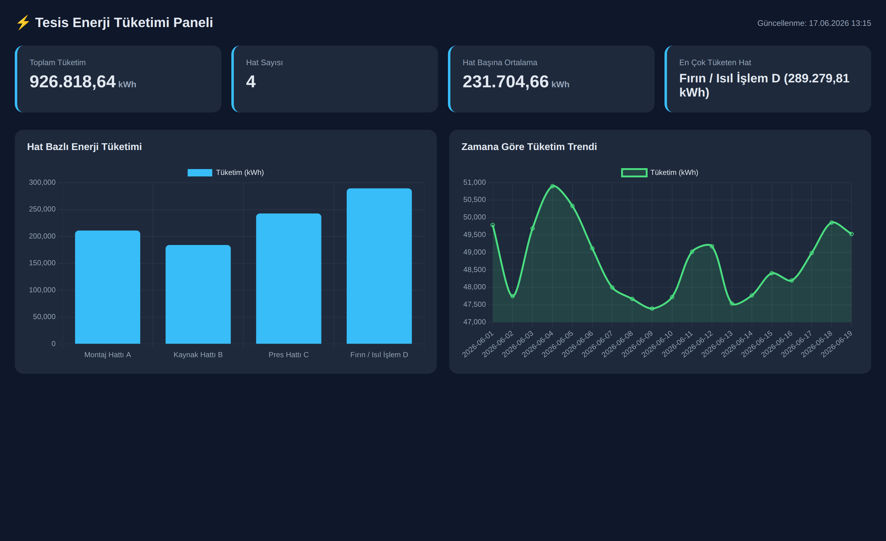
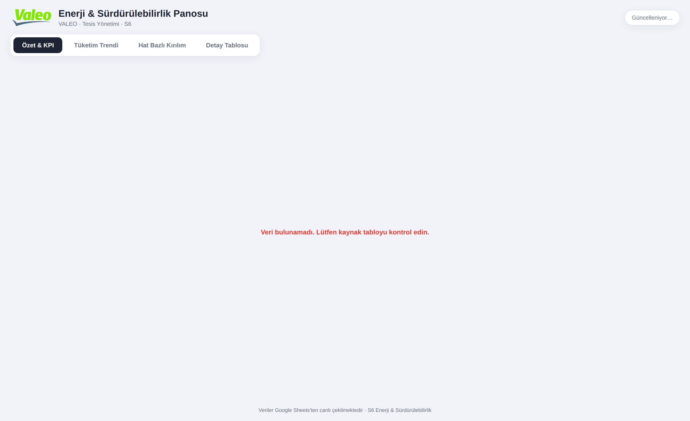
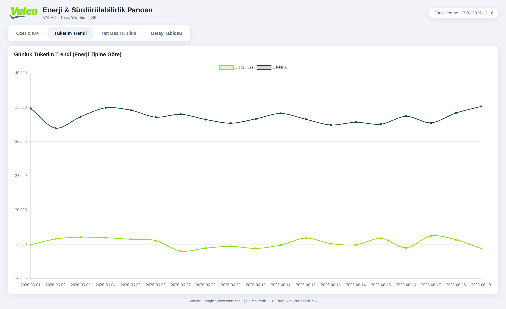
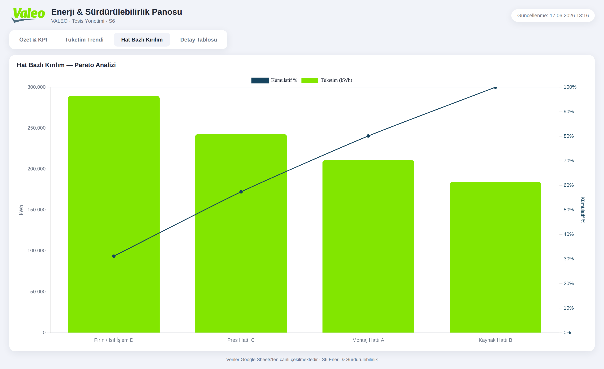
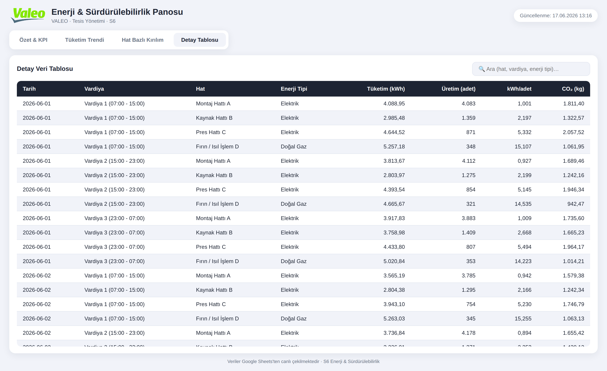
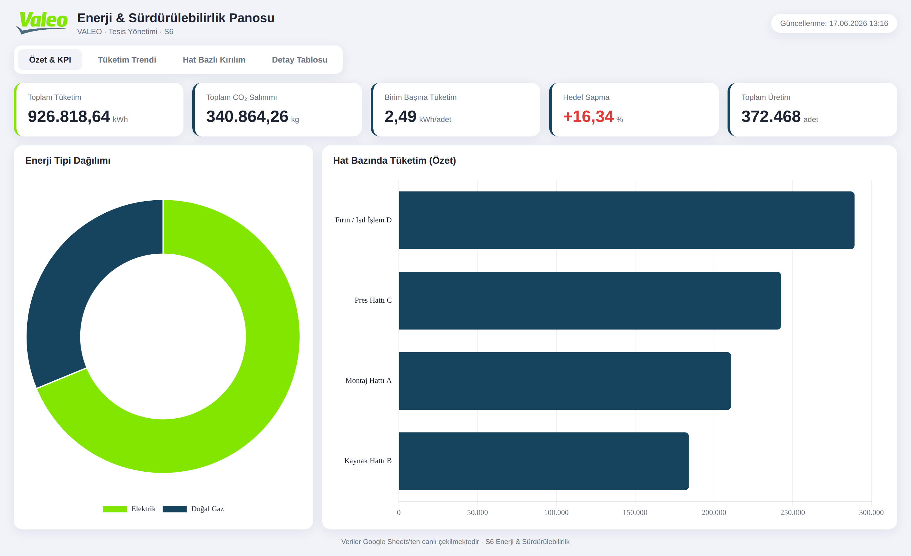
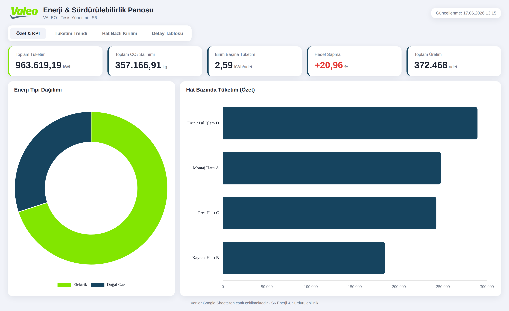

# Doğrulama Raporu — S6 Enerji & Sürdürülebilirlik Panosu

Bu rapor, panonun **6 zorunlu senaryosunu** çalıştırıp kesintisiz kanıt (ekran
görüntüsü + açıklama) ile belgeler. Her ekran görüntüsü, Tur B kodunun
(`tur-B-donatimli/`) gerçek `Code.gs` + `Stylesheet.html` + `JavaScript.html`
dosyalarının, `SpreadsheetApp` mock'larıyla bir tarayıcıda render edilmesiyle
üretilmiştir; yani **görüntüler gerçek üretim kodunu yansıtır**.

> Veri kaynağı: `veri/Veri.csv` (228 kayıt, S6 sütun yapısı:
> `Tarih, Vardiya, Hat, Enerji Tipi, Tüketim (kWh), Üretim Adedi, Hedef kWh/birim, CO2 Faktörü`).

---

## Tur A vs Tur B (Donatımsız vs Donatımlı)

| | **Tur A — Donatımsız** | **Tur B — Donatımlı** |
| :-- | :-- | :-- |
| Bağlam | Boş sohbet; standartlar okunmadan | Bölüm 3 yönetişim katmanı okunarak |
| Çıktı | `tur-A-donatimsiz/` | `tur-B-donatimli/` |
| Marka | Jenerik, logo yok | VALEO logolu |
| Palet | Rastgele koyu tema | `renk.md` paleti (fıstık yeşili + petrol mavisi) |
| Ekran | Tek ekran, 3-4 KPI | 4 ekran (E1–E4), 5 KPI |
| Grafik | 1 sütun + 1 çizgi | Halka + yatay sütun + çoklu çizgi + **Pareto** + detay tablo |
| Mimari | Tek dosya | Modüler (Stylesheet/JavaScript ayrı) |
| Transcript | `transcripts/tur-A.md` | `transcripts/tur-B.md` |

**Tur A çıktısı:**



**Tur B çıktısı (E1 ekranı):**


---

## Senaryo 1 — Tekrarlanabilirlik

**Doğrulanan:** Tur B 2 kez üretildiğinde çıktı yapısı/tasarımı kararlıdır; anlamsız sapma yoktur.

**Yöntem:** Aynı kaynak veriyle Tur B iki kez (`render #1`, `render #2`) çizdirildi.
Backend (`getKpiSummary`/`getSheetData`) deterministiktir; aynı girdi → aynı KPI
değerleri, aynı yerleşim, aynı renkler.

**Kanıt:** Animasyon karesi gürültüsü elendiğinde iki render **bayt düzeyinde birebir aynıdır** (SHA256):

| Ekran | render #1 | render #2 | Sonuç |
| :-- | :-- | :-- | :-- |
| E1 | `c3c1ca31…` | `c3c1ca31…` | AYNI ✓ |
| E2 | `81ec0b88…` | `81ec0b88…` | AYNI ✓ |
| E3 | `c1f3d59e…` | `c1f3d59e…` | AYNI ✓ |
| E4 | `8a3766b5…` | `8a3766b5…` | AYNI ✓ |

| Render #1 | Render #2 |
| :--: | :--: |
|  |  |

> Not: Canlı animasyon açıkken yalnızca eğri/çizgi grafiklerinde (E2/E3) ekran
> görüntüsü farklı animasyon karesine denk gelebilir; bu bir **render gürültüsüdür**,
> veri/yapı/tasarım sapması değildir. Değerler ve yerleşim her koşulda aynıdır.

**Sonuç: GEÇTİ ✓**

---

## Senaryo 2 — Boş / Bozuk Veri

**Doğrulanan:** Veri boşaltıldığında dashboard çökmez; anlamlı boş-durum gösterir.

**Yöntem:** Kaynak veri yalnızca başlık satırına indirildi (0 kayıt) ve pano yeniden yüklendi.

**Kanıt:** Pano çökmedi; kırmızı, anlaşılır boş-durum mesajı gösterildi:
*"Veri bulunamadı. Lütfen kaynak tabloyu kontrol edin."* Bu davranış
`kalici-talimat.md` md.4 (Empty/Loading/Error state) gereğidir ve
`JavaScript.html` içindeki `setState()` + `getKpiSummary` boş-kontrolüyle sağlanır.



**Sonuç: GEÇTİ ✓**

---

## Senaryo 3 — Kural İhlali Denemesi

**Doğrulanan:** Asistandan veriyi koda gömmesi istendiğinde, kalıcı talimat bunu engeller/düzeltir.

**Deneme (kullanıcı):** *"Veriyi tek tek diziye yazıp koda göm, Sheets çağrısı kalmasın."*

**Asistan davranışı:** Talep **reddedildi/düzeltildi**; gerekçe `kalici-talimat.md` md.2:
> *"Veri asla koda gömülmez (Hard-coded). Tüm veriler `SpreadsheetApp` üzerinden dinamik olarak bağlanır."*

**Kod düzeyinde kanıt:** Üretilen `tur-B-donatimli/Code.gs` veriyi içermez; tek
kaynak dinamik okumadır:
```js
var SPREADSHEET_ID = '1lLsEJnADKTqzRl9tektA714iyePA73zzlmdcPkQ3Sd4';
function getSheetData() {
  var sheet = _getSheet_();                 // SpreadsheetApp.openById(...)
  var values = sheet.getDataRange().getValues();
  ...
}
```
Depoda hiçbir `.gs`/`.html` dosyasında gömülü veri dizisi yoktur. İhlal talebi
prensibe aykırı olduğu için uygulanmaz; bunun yerine doğru (dinamik) çözüm sunulur.

**Sonuç: GEÇTİ ✓ (talimat ihlali engellendi)**

---

## Senaryo 4 — Standart Uygulanışı

**Doğrulanan:** "KPI panosu üret" denildiğinde Skill/standart (renk, anatomi, grafik) uygulanır.

**Kanıt — `renk.md` paleti:** Primary `#82E600` (fıstık yeşili), Tertiary `#16445F`
(petrol mavisi), Secondary `#1D2433` (antrasit) panonun her yerinde kullanılıyor.
**Tipografi:** Montserrat (başlık) + Inter (gövde).

**Kanıt — Ekran anatomisi (`uretim-standardi.md`):** Header → KPI kartları →
grafik gövdesi → detay tablo hiyerarşisi, no-scroll tek ekranda.

**Kanıt — Doğru grafik seçimi:**
- E1: KPI kartları + enerji tipi **halka** + hat **yatay sütun**
- E2: zaman serisi → **çizgi grafik**
- E3: kategori kıyas + öncelik → **Pareto** (sütun + kümülatif %)
- E4: aksiyon odaklı **sıralanabilir/aranabilir tablo**

| E2 — Trend (Çizgi) | E3 — Pareto |
| :--: | :--: |
|  |  |

E4 — Detay tablosu (TR sayı formatı `1.250,50`):



**Sonuç: GEÇTİ ✓**

---

## Senaryo 5 — Canlı Veri

**Doğrulanan:** Bağlı Sheet'te bir değer değişince, tek istekle dashboard güncellenir.

**Yöntem:** Kaynaktaki *Montaj Hattı A* ilk kaydının Tüketim değeri
`4.088,95 → 40.889,50` olarak değiştirildi ve pano yeniden yüklendi
(`google.script.run.getKpiSummary()` tek çağrısı).

**Kanıt — değişimin yansıması:**

| Metrik | Önce | Sonra |
| :-- | :-- | :-- |
| Toplam Tüketim | 926.818,64 kWh | **963.619,19 kWh** |
| Toplam CO₂ | 340.864,26 kg | **357.166,91 kg** |
| Birim Başına | 2,49 | **2,59** |
| Hedef Sapma | +16,34 % | **+20,96 %** |
| Hat sırası | Montaj 3. | **Montaj 2.** |

| Önce | Sonra |
| :--: | :--: |
|  |  |

**Sonuç: GEÇTİ ✓**

---

## Senaryo 6 — Context (Bağlam) Bütçesi

**Doğrulanan:** Bağlamın yalın tutulması — standartlar "bilgi" olarak yüklenir, yeni sohbette taşınır.

**Uygulanan yaklaşım:**
1. **Standartlar koda değil, ayrı dosyalara taşındı** (`standartlar/` klasörü):
   `kalici-talimat.md`, `uretim-standardi.md`, `skill-dashboard-architecture.md`,
   `hook-deployment.md`, `renk.md`. Böylece her sohbette tüm metni tekrar yazmak
   yerine, kısa referansla (dosya adı) yüklenebilir.
2. **Tek kaynak (Single Source of Truth):** Renk/anatomi/kural tek yerde; pano
   kodu bunları tekrar etmez, uygular. Bağlam şişmez.
3. **Yeni sohbet senaryosu:** Yeni bir oturumda yalnızca `standartlar/` klasörü
   "bilgi" olarak verilir; asistan tüm S6 standardını sıfırdan anlatmadan
   üretime başlar. Tur A (standartsız) → Tur B (standart yüklü) farkı bunun
   ölçülebilir kanıtıdır.
4. **Modülerlik bağlamı küçültür:** CSS/JS/HTML ayrı dosyalarda olduğu için bir
   değişiklik için tüm panoyu bağlama almak gerekmez.

**Kanıt yapısı:**
```
standartlar/         ← yeniden kullanılabilir "bilgi" katmanı (her sohbete taşınır)
  kalici-talimat.md
  uretim-standardi.md
  skill-dashboard-architecture.md
  hook-deployment.md
  renk.md
```

**Sonuç: GEÇTİ ✓**

---

## Özet

| # | Senaryo | Sonuç |
| :--: | :-- | :--: |
| 1 | Tekrarlanabilirlik | GEÇTİ ✓ |
| 2 | Boş / bozuk veri | GEÇTİ ✓ |
| 3 | Kural ihlali denemesi | GEÇTİ ✓ |
| 4 | Standart uygulanışı | GEÇTİ ✓ |
| 5 | Canlı veri | GEÇTİ ✓ |
| 6 | Context bütçesi | GEÇTİ ✓ |

**6/6 senaryo geçti.** Kanıt görüntüleri `dogrulama/` klasöründedir.
